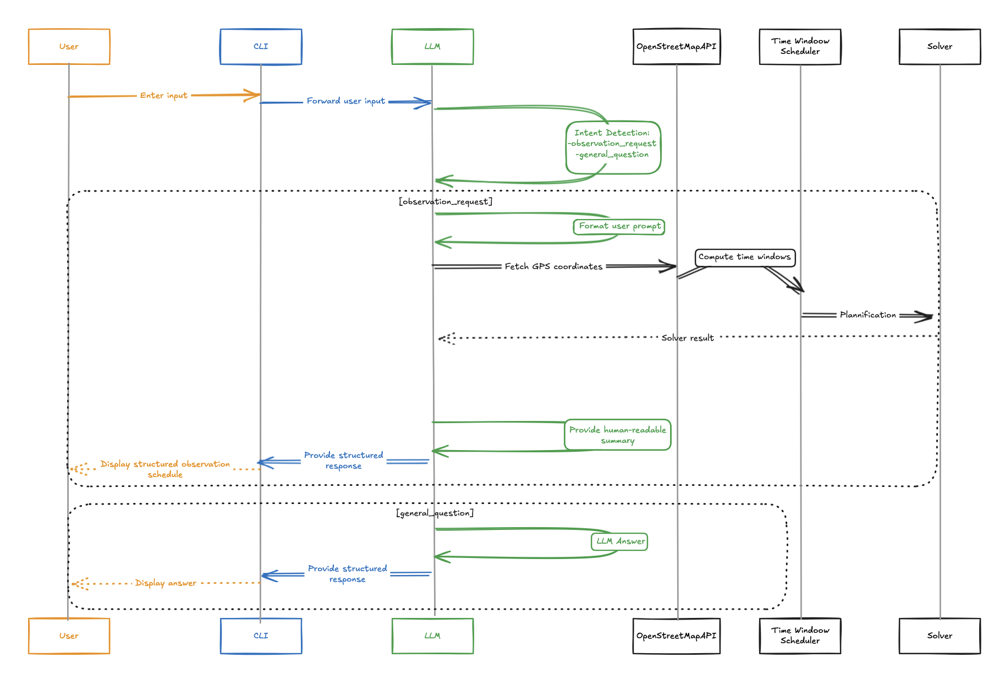

# Système de Planification et d'Observation Assisté par LLM

Ce projet implémente un système intelligent qui utilise un modèle de langage (LLM) pour traiter les demandes utilisateur concernant des observations et planifications, en s'appuyant sur des services de géolocalisation et d'optimisation de fenêtres temporelles.



## Table des matières
1. [Vue d'ensemble](#vue-densemble)
2. [Architecture du système](#architecture-du-système)
3. [Composants](#composants)
   - [Interface utilisateur (CLI)](#interface-utilisateur-cli)
   - [Module LLM](#module-llm)
   - [Détection d'intention](#détection-dintention)
   - [OpenStreetMapAPI](#openstreetmapapi)
   - [Time Window Scheduler](#time-window-scheduler)
   - [Solver](#solver)
4. [Flux de travail](#flux-de-travail)
   - [Traitement des demandes d'observation](#traitement-des-demandes-dobservation)
   - [Traitement des questions générales](#traitement-des-questions-générales)
5. [Simplifications et limitations](#simplifications-et-limitations)
6. [Installation et configuration](#installation-et-configuration)
7. [Utilisation](#utilisation)
8. [Exemples](#exemples)

## Vue d'ensemble

Ce système permet aux utilisateurs de planifier des observations ou de poser des questions générales via une interface en ligne de commande. Selon l'intention détectée, le système peut:
- Planifier des observations optimales basées sur les coordonnées GPS et les contraintes temporelles
- Répondre à des questions générales grâce au modèle de langage

Le système intègre plusieurs composants spécialisés qui travaillent ensemble pour traiter les requêtes et générer des réponses structurées et facilement compréhensibles.

## Architecture du système

Comme le montre le schéma, l'architecture est composée de six composants principaux:

1. **User**: L'utilisateur qui interagit avec le système via le CLI
2. **CLI**: Interface en ligne de commande qui reçoit les entrées et affiche les résultats
3. **LLM**: Le modèle de langage qui analyse les requêtes et génère les réponses
4. **OpenStreetMapAPI**: Service externe pour obtenir des informations géographiques
5. **Time Window Scheduler**: Module de calcul des fenêtres temporelles optimales
6. **Solver**: Moteur d'optimisation qui génère les plannings d'observation

Le système utilise une architecture modulaire qui facilite la maintenance et l'extension.

## Composants

### Interface utilisateur (CLI)

L'interface en ligne de commande sert de point d'entrée pour les utilisateurs.

### Module LLM

Le coeur du système, responsable de l'analyse des entrées utilisateur et de la génération de réponses.

**Implémentation**:
- Utilise une API de modèle de langage (Claude, GPT, etc.)
- Effectue la détection d'intention sur les entrées utilisateur
- Formate les requêtes et réponses entre les différents composants
- Génère des explications et résumés en langage naturel

### Détection d'intention

Ce module analyse l'entrée utilisateur pour déterminer s'il s'agit d'une demande d'observation ou d'une question générale.

**Implémentation**:
- Utilise des techniques d'analyse sémantique via le LLM
- Catégorise les requêtes en deux types principaux:
  - `observation_request`: Demandes de planification d'observation
  - `general_question`: Questions générales sur le système ou autres sujets

**Simplifications**:
- Classification binaire simple au lieu d'une taxonomie complexe d'intentions
- Pas de gestion des intentions ambiguës ou multiples
- Analyse basée uniquement sur le texte sans contexte historique

### OpenStreetMapAPI

Interface avec les services de cartographie pour obtenir des informations géographiques.

**Implémentation**:
- Utilise l'API OpenStreetMap pour récupérer les coordonnées GPS
- Convertit les noms de lieux en coordonnées de latitude/longitude

**Simplifications**:
- Pas de vérification avancée de la précision des coordonnées

### Time Window Scheduler

Ce module calcule les fenêtres temporelles optimales pour les observations.

**Implémentation**:
- Analyse les contraintes temporelles spécifiées par l'utilisateur
- Calcule les créneaux disponibles en fonction des coordonnées GPS et de la position du satellite
- Génère des fenêtres temporelles pour le Solver

**Simplifications**:
- Modélisation simple des contraintes temporelles
- Prise en compte limitée des facteurs environnementaux

### Solver

Le moteur d'optimisation qui génère les plannings d'observation optimaux.

**Implémentation**:
- Utilise des algorithmes d'optimisation pour planifier les observations
- Maximise l'efficacité des observations selon les contraintes données
- Génère un planning détaillé avec des horaires précis

**Simplifications**:
- Algorithmes d'optimisation simplifiés pour les petits ensembles de données
- Pas de prise en compte des contraintes multi-objectifs complexes
- Optimisation locale plutôt que globale pour les problèmes de grande taille

## Flux de travail

Le système gère deux flux de travail principaux, selon l'intention détectée:

### Traitement des demandes d'observation

1. L'utilisateur entre une demande d'observation via le CLI
2. Le CLI transmet la requête au module LLM
3. Le LLM détecte l'intention comme `observation_request`
4. Le LLM formate la requête utilisateur pour extraction des paramètres
5. Le système récupère les coordonnées GPS via OpenStreetMapAPI
6. Le Time Window Scheduler calcule les fenêtres temporelles appropriées
7. Les données sont transmises au Solver pour la planification
8. Le Solver renvoie un résultat optimisé au LLM
9. Le LLM génère un résumé en langage naturel
10. Le CLI affiche une réponse structurée à l'utilisateur

### Traitement des questions générales

1. L'utilisateur pose une question via le CLI
2. Le CLI transmet la question au module LLM
3. Le LLM détecte l'intention comme `general_question`
4. Le LLM génère directement une réponse
5. Le CLI affiche la réponse à l'utilisateur

## Simplifications et limitations

Le système actuel présente plusieurs simplifications pour faciliter l'implémentation:

1. **Détection d'intention binaire**: La classification des requêtes est limitée à deux catégories, ce qui peut ne pas couvrir tous les cas d'utilisation.

2. **Intégration API limitée**: L'utilisation d'APIs externes est simplifiée, sans gestion avancée des erreurs ou des limitations de débit.

3. **Planification temporelle simplifiée**: Les algorithmes de planification ne prennent pas en compte toutes les variables possibles (météo détaillée, accessibilité, etc.).

4. **Absence d'état utilisateur**: Le système ne maintient pas d'historique détaillé des interactions ou des préférences utilisateur.

5. **Interface textuelle basique**: L'interface CLI offre des fonctionnalités limitées par rapport à une interface graphique ou web.

6. **Optimisation locale**: Les algorithmes d'optimisation privilégient la rapidité sur l'optimalité globale pour les problèmes complexes.

7. **Pas de persistance des données**: Les résultats et configurations ne sont pas sauvegardés entre les sessions.

## Installation et configuration

```bash
# Cloner le repo
git clone https://github.com/lucasduport/SatelliteCaptureScheduler
cd observation-planning-system

# Installer les dépendances
pip install -r requirements.txt

# Configurer les clés API
cp .env.example .env
# Éditer .env pour ajouter vos clés API
```

## Utilisation

- Lancer une demo avec des données d'exemple
```bash
python main.py sample
```
- Demande d'observation
```bash
python main.py llm
> Je voudrais un cliché de la Tour Eiffel le plus vite possible, ainsi que de la Siberie
```

- Question générale
```bash
python main.py llm
> Bonjour, comment vas-tu ?
```

## Exemples

### Exemple 1: Demande d'observation
```
> Je voudrais un cliché la Tour Eiffel, ainsi qu'un cliché urgent de Tokyo. Et quand c'est possible, l'Australie
```
