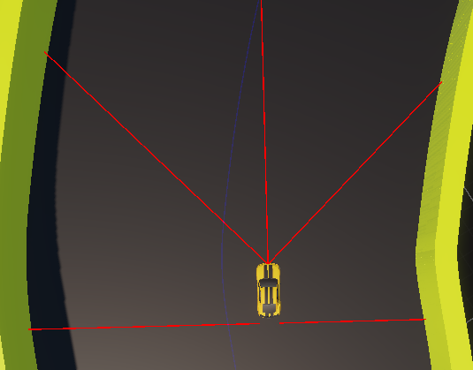
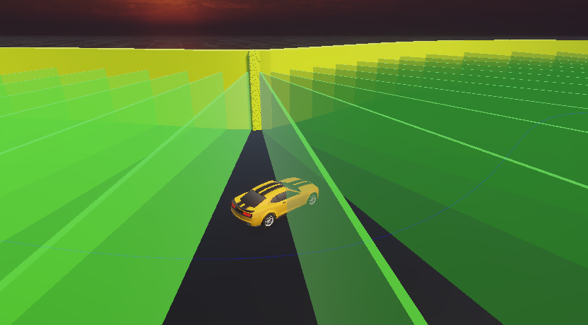
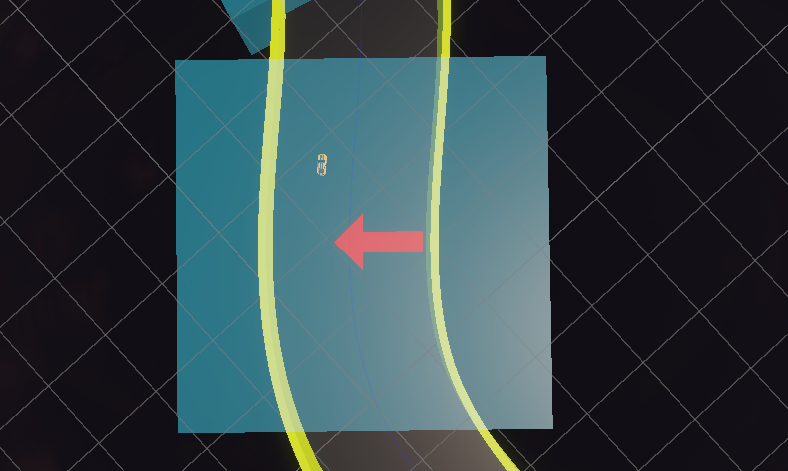

# Présentation
Ce projet a pour objectif d’entraîner des voitures à conduire de manière autonome sur un circuit,
grâce à un algorithme génétique couplé à un réseau de neurones. L'objectif était d'apprendre aux modèles
à conduire le plus vite possible, tout en évitant les murs et en ajustant sa trajectoire suite à des bourrasques de vent. En bonus nous voulions aussi apprendre à un modèle à conduire en dérapant.

Ce projet à été intégralement écrit en C# et utilise le moteur de jeu Unity pour la simulation.

# Sommaire
- [Objectifs du projet](#objectifs-du-projet)
- [Étapes du projet](#étapes-du-projet)
  - [1 - Génération des voitures](#1---génération-des-voitures)
  - [2 - Définition des entrées/sorties du réseau de neuronnes](#2---définition-des-entrées/sorties-du-réseau-de-neuronnes)
  - [3 - Évaluation des performances (fitness)](#3---évaluation-des-performances-fitness)
- [Choix de modélisation](#choix-de-modélisation)
- [Ajoute de contrainte physique : le vent](#ajout-de-contrainte-physique--le-vent)
- [Expérimentations](#expérimentations)
- [Résultats obtenus](#résultats-obtenus)

---

## Objectifs du projet
- Apprendre à un réseau de neuronnes à piloter une voiture virtuelle sur un circuit sans toucher les murs
- Optimiser les trajectoires afin d'aller le plus vite possible
- Intégrer des contraintes environnementales telles que des bourrasques de vent et observer la robustesse de l'apprentissage
- Tester la capacité du modèle à apprendre des comportements complexes comme les dérapages contrôlés

## Étapes du projet
### 1 - Génération des voitures
- Chaque voiture est contrôlée par un réseau de neurones simple (MLP)
- Initialement, les poids sont générés aléatoirement
- A chaque génération, un algorithme génétique sélectionne les meilleurs individus et génère une nouvelle population par croisements et mutations

### 2 - Définition des entrées/sorties du réseau de neuronnes
- Entrées :
  - Valeurs de distance par rapport aux murs dans diverses directions
  - Vitesse actuelle de la voiture
  - Pour les dérapages nous avons donnés plus de directions pour les distances, des valeurs de vitesse directionnelle, ainsi que son orientation dans l'espace afin de permettre à la voiture de controler ses dérapages

- Sorties :
  - Une valeur pour accélérer/freiner
  - Une valeur pour tourner à gauche ou à droite

### 3 - Évaluation des performances (fitness)
- Le circuit est balisé avec des checkpoints espacés régulièrement
- Chaque fois qu'une voiture passe un checkpoint, son score augmente
- Les voitures sont sélectionnées par le nombre de checkpoints, mais aussi par la vitesse à laquelle elles ont effectué un tour de circuit si elles ont réussi

## Choix de modélisation
- Réseau de neurones simple possédant une ou deux couches cachées possédant moins de 10 neurones
- Algorithme génétique avec :
  - Sélection des meilleurs parents (top 10)
  - Croisements entre les parents
  - Mutations aléatoires contrôlées

## Ajout de contrainte physique : le vent
Pour tester la robustesse de notre approche, nous avons ajouté des vents directionnels sur les circuits.
Ce vent pousse la voiture dans une direction choisie, ce qui la force à adapter son comportement.

## Expérimentations
- Sans vent :
  - Les voitures apprennent très rapidement et efficacement (moins de 5 époques) à conduire sur des circuits simples comportant des virages
  - Les voitures apprennent de manière efficace à coller les murs le plus possible afin de gagner en vitesse sur le circuit
- Avec vent :
  - Les voitures apprennent plus difficilement à gérer efficacement leur comportement fâce aux perturbations
  - Bien qu'elles apprennent à aller de plus en plus vite, une distance de sécurité est gardée par rapport aux murs afin de leurs permettre de réagir
- Dérapages :
  - Nous avons dû augmenter la taille du réseau et le nombre d'entrées que nous lui donnons car la tâche est beaucoup plus complexe
  - Apprentissage plus lent que pour le vent

## Résultats obtenus
- Le système est capable de produire des comportements de conduite stables et efficaces, après plusieurs dizaines de générations selon les contraintes
- L'algorithme est résilient et capable de s'adapter à des perturbations environnementales comme le vent
- En fonction du circuit et des contraintes, des comportements de conduite différents sont observés (coller / prendre ses distances par rapport aux murs)
